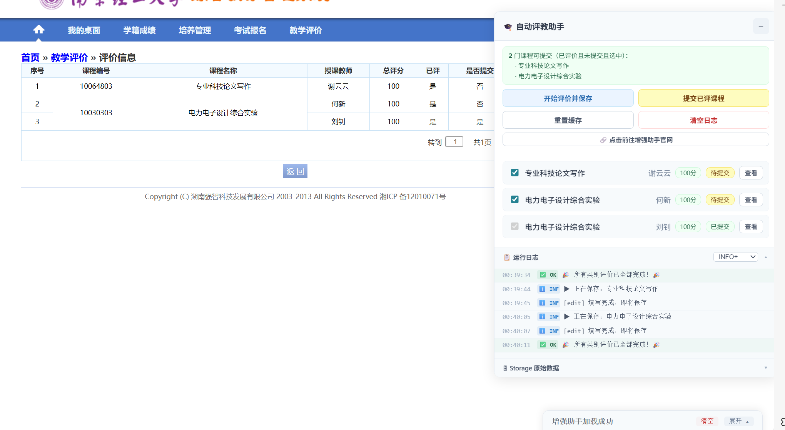
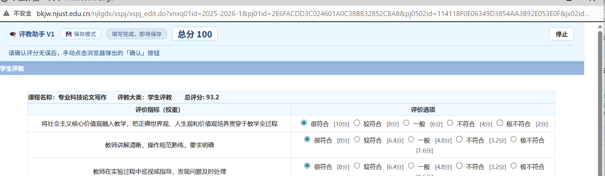
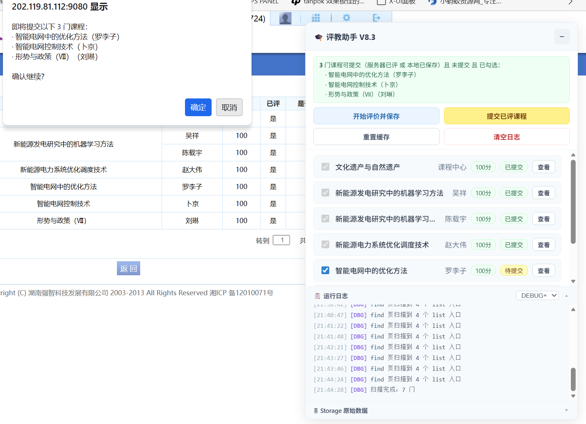

# 南京理工大学自动评教助手 · 使用说明

# NJUST · **A**uto **C**ourse **E**valuation

> **自动评教 现在是 教务增强助手V2 的一部分**
> 适用页面：南京理工大学教务系统评教页面（`xspj_*.do`）
> 理论上还适配其他强智教务系统，本项目以 MIT 协议开源，欢迎二次开发

面向 NJUST 学生评教场景的自动化课程评价（Auto Course Evaluation）脚本。它提供安全可控的“一键评教/批量提交”能力，同时保留手动精调与复核环节，兼顾效率与准确性。

---
这是广告语：
> 同学们！还在为每学期几十份评教抓狂吗？  
> 手指戳烂、眼睛看花，时间却像水一样流走。  
> 今天，我们带来一款“价格厚道、体验极致”的——  
> **NJUST 自动评教助手**！  
> 
> 它，**3 年磨一剑**，只为一个目标：  
> **让评教，像扫码骑车一样简单！**  
> 
> - **一键自动评教＋提交**，效率提升 300%  
> - **手动模式**，随时微调，分数一目了然  
> - **纯本地脚本**，0 上传、0 后台、0 隐私泄露  
> - **无服务器、无收集、无广告**，安心用到毕业  
> 
> **唯一一点小遗憾**：  
> 浏览器最后那一下确认弹窗，还得你亲手点——  
> **安全红线，我们绝不越界！**  
> 
> 由 Claude 、Gemini 、豆包  
> 三大 AI 联合调校，只为极致体验。  
> 
> **把重复劳动交给代码，把时间留给自己。**  


---

## 一、 功能亮点


### 功能亮点

* **批量处理**：对勾选的课程依次执行“进入 → 填分 → 保存/提交”
* **两种模式**：手动模式（可微调每项得分）与自动模式（默认最高分）
* **安全策略**：涉及“提交”时始终要求用户手动确认，不进行自动点击
* **可视化日志**：底部“增强助手运行日志”实时输出执行过程与结果
* **可回溯**：先“保存为待提交”，核对后再集中提交，降低误操作风险


<div style="background-color: #fffbeb; border-left: 4px solid #f59e0b; padding: 12px 16px; margin: 16px 0; border-radius: 4px;">
  <strong style="color: #92400e;">⚠️ 注意</strong>
  <p style="margin: 8px 0 0 0; color: #78350f; line-height: 1.5;">
    在提交前，务必手动核对所有信息，脚本不对可靠性负责！
  </p>
</div>

### 界面截图展示

* **引导页**：
* 

* **课程列表页**：
*  

* **自动评教展示**：
* 

* **手动模式**：
* 

* **自动提交**：
* 

---

## 二、 快速上手指南

只需以下几个步骤，即可快速完成评教：

1. 进入评教入口页（“类别”列表页）。
2. 点击任一类别卡片，进入该类别的“课程列表页”。
3. 在课程列表页：
* 勾选需要自动处理的课程（默认全选）。
* 点击“开始评价并保存”以批量填分并保存为“待提交”。
* 核对无误后，点击“提交已评课程”批量提交。


4. 如需单独核对，可使用每行的“查看”按钮在新窗口打开评价页。
5. 如果需要清理状态：
* “重置缓存”会清空本模块的本地缓存与进度标记；
* “清空日志”仅清理底部运行日志，不影响已保存/提交记录。


---

## 三、 详细操作步骤与页面说明

### 页面类型说明

助手在三种页面上分别工作，各自承担不同职责：

| 页面 | URL 特征 | 主要功能 |
| --- | --- | --- |
| **FIND 页**（入口） | `xspj_find.do` | 显示所有评教类别入口，查看各类别完成进度 |
| **LIST 页**（列表） | `xspj_list.do` | 管理课程勾选、启动自动评价流水线、批量提交 |
| **EDIT 页**（编辑） | `xspj_edit.do` | 实际填写评分，支持自动模式和手动模式 |

### 第一步：进入入口页（FIND 页）

打开评教系统后会看到各评教类别的入口列表。助手面板右上角显示每个类别的**完成进度**（已完成 / 总数）和当前运行状态：

* `等待中`：该类别尚未开始
* `已完成`：该类别所有课程均已提交

点击任意类别右侧的 **「进入」** 按钮跳转到该类别的课程列表。

> **注**：该状态是根据 LocalStorage 中的数据得出的，不会实时更新。因此可能和实际情况有所差异。请以教务系统为准。

### 第二步：选择课程（LIST 页）

进入列表页后，助手会自动扫描当前页面的所有课程并显示在面板中。

* **勾选规则**：默认**全部勾选**，即所有未提交课程都将参与自动处理。
* 取消勾选某门课 → 该课标记为「不操作」，流水线跳过。
* 已提交的课程**不可勾选**，流水线永远不会重复操作。

### 第三步：自动评价并保存（LIST 页）

点击面板中的 **「开始评价并保存」** 按钮。流水线启动后会自动依次处理勾选课程（通过「忙碌锁」`KEY_BUSY` 保证单线程执行，防止冲突），并将课程状态变更为**「待提交」**。

### 第四步：批量提交（LIST 页）

所有课程保存完毕后，面板顶部会出现绿色提示栏，列出可提交的课程数量。
点击 **「提交已评课程」** 按钮，系统会弹出确认对话框，列出所有即将提交的课程名称。

> ⚠️ **重要**：提交时浏览器会弹出原生确认对话框，**必须由用户手动点击「确定」**，脚本无法自动处理此步骤。

### 手动模式（EDIT 页直接打开时）

如果直接从教务系统原始链接打开评价页面，助手会自动进入**手动模式**，在页面顶部显示快捷操作栏：

| 按钮 | 说明 |
| --- | --- |
| 最高分 | 填写尽可能高的分数组合 |
| 中高分 | 整体偏高，部分题目选次高档 |
| 中分 | 选择中间档位 |
| 低分 | 选择较低档位 |

点击任意策略按钮后，页面右侧会实时显示当前总分。填写满意后，**仍需手动点击页面上原有的「保存」或「提交」按钮**完成操作。

---

## 四、 状态与策略说明

### 状态标签含义

| 标签 | 颜色 | 含义 |
| --- | --- | --- |
| `待评价` | 橙色 | 尚未填写评分，等待流水线处理 |
| `待提交` | 黄色 | 已填写并保存，等待提交 |
| `已提交` | 绿色 | 已完成全部流程，不再被操作 |
| `不操作` | 灰色 | 已被用户手动取消勾选，流水线跳过 |

### 填分策略说明

所有策略都使用**扰动机制**：在所有题目中找到两个相邻档位分值差最小的那道题，对其做相反方向的偏移，使整体分数看起来更自然，避免所有题目选同一档位。

| 策略 | 行为 |
| --- | --- |
| **最高分**（自动默认） | 其余题选最高档，扰动题选次高档 |
| **中高分** | 其余题选次高档，扰动题选最高档 |
| **中分** | 其余题选中间档，扰动题偏移一档 |
| **低分** | 其余题选最低档，扰动题选倒数第二档 |

---

## 五、 技术实现与底层运行机制

自动评教助手采用 **“主控调度 + 详情执行”** 的分布式架构，利用 `localStorage` 实现多窗口间的状态同步和互斥锁控制。

### 整体流程概览

```text
FIND 页（入口导航）
    │
    ▼ 点击"进入"
LIST 页（课程列表）
    │
    ├─── ① 勾选要处理的课程
    ├─── ② 点击「开始评价并保存」
    │         │
    │         ▼ 自动依次弹窗
    │      EDIT 页（评价填写）× N 门课
    │         │  自动填分 → 自动保存 → 自动关闭
    │         ▼
    │      课程状态变为「待提交」
    │
    └─── ③ 点击「提交已评课程」
              │
              ▼ 自动依次弹窗
           EDIT 页（提交确认）× N 门课
              │  ⚠️ 需手动点击浏览器弹出的「确认」对话框
              ▼
           课程状态变为「已提交」✓

```

### 1. 核心关键状态 (LocalStorage)

* `njust_eval_v1_store`: 核心数据库，记录所有课程的 ID、名称、教师、URL、是否勾选自动化、是否已完成评价等信息。
* `njust_eval_running`: 全局开关，指示是否正在执行“自动填分并保存”的流水线。
* `njust_eval_subrun`: 全局开关，指示是否正在执行“批量提交”的流水线。
* `njust_eval_busy` / `njust_eval_subbsy`: **互斥锁**。确保同一时间只有一个评价详情页在执行自动化动作，防止因网络延迟导致多个窗口同时开启。

### 2. 自动化流水线流程

**2.1 自动填分并保存流程 (Save Pipeline)**

1. **启动**：用户在 `xspj_list.do` 页面点击“开始评价并保存”。
2. **标记**：系统将 `njust_eval_running` 设为 `true`。
3. **调度**：遍历 `store`，寻找第一个 `auto=true` 且 `done=false` 的课程。若找到，设置 `njust_eval_busy=true`，并在新窗口打开该课程 URL（追加 `isAutoEval=true` 参数）。
4. **执行 (详情页)**：
* 页面加载后，脚本识别到 `isAutoEval` 参数。
* **评分策略**：默认执行 `highest` 策略（全选最高分，并在分值差距最小的题目选次高分以规避全满分拦截）。
* **自动保存**：调用页面原生的 `saveData` 函数执行保存操作。
* **完成回调**：保存成功后，更新 `store` 中的 `done=true`，将 `njust_eval_busy` 设为 `false`，并关闭当前窗口。


5. **循环**：`xspj_list.do` 页面监听 `storage` 事件，一旦发现 `busy` 锁释放，立即触发下一次调度。

**2.2 批量提交流程 (Submit Pipeline)**

1. **启动**：用户在列表页点击“提交已评课程”。
2. **队列**：将所有“待提交”状态的课程 URL 存入 `njust_eval_subqueue`。
3. **调度**：设置 `njust_eval_subrun=true`，从队列中取出一个 URL，设置 `njust_eval_subbsy=true` 并打开详情页（追加 `isAutoSubmit=true` 参数）。
4. **执行 (详情页)**：识别到 `isAutoSubmit` 参数，直接调用原生的提交函数。提交后关闭窗口，释放 `subbsy` 锁。
5. **循环**：列表页检测到锁释放，继续取出下一个队列项，直到队列清空。

### 3. 评分算法底层逻辑

为了规避教务系统的“全满分限制”或“评分雷同”检测，评教助手 引入了**智能扰动算法**：

* **最高分策略 (Highest)**：算法自动计算所有题目的分值梯度（最高分 - 次高分）。选择梯度最小（即损失分值最少）的那道题，将其选为“次高分”，其余题目全部选为“最高分”。**目的**：在保证总分最高（通常为 99+）的前提下，使选项不全为第一项。
* **手动模式**：在手动评教页面，脚本会在每个 Radio 选项后实时标注其代表的真实分值。提供“最高分、中高分、中分、低分”四档快捷填分按钮，方便用户快速填充后自行微调。

---

## 六、 常见问题与注意事项

### 常见问题 (FAQ)

* **Q：流水线启动后可以中途停止吗？**
A：在 EDIT 页顶部操作栏有「停止」按钮，点击后当前窗口会停止自动操作，但已在队列中等待的逻辑不会立即取消。回到 LIST 页后点击「重置缓存」可彻底停止。
* **Q：某门课我想手动填分，不想让脚本自动处理，怎么办？**
A：在 LIST 页取消勾选该课程，脚本即跳过，不影响其他课程的自动流程。
* **Q：保存成功了，但提交时一直弹出「无可提交课程」？**
A：确认该课程在列表页面的「是否评价」列已经显示「是」，并且在助手面板中处于「待提交」状态。若两者都满足，尝试刷新页面后重新点击「提交已评课程」。
* **Q：脚本的运行日志在哪里看？**
A：面板底部「📋 运行日志」区域记录了全部操作日志，可通过旁边的下拉菜单按级别过滤（DEBUG / INFO / OK / WARN / ERROR）。日志持久化存储在 `localStorage` 中，刷新页面后仍然保留。

### 注意事项 (避坑指南)

* **关于弹窗拦截**：流水线通过 `window.open()` 打开子窗口。现代浏览器对非用户主动点击触发的弹窗有拦截策略——通过面板按钮点击触发的第一个窗口通常不会被拦截，但后续窗口在部分浏览器下可能被拦截，导致流水线卡住。如果长时间无响应，请检查浏览器地址栏是否出现「弹窗已被阻止」的提示，手动允许即可。
* **关于「忙碌锁」卡死**：如果子窗口被意外关闭而没有正常执行释放锁的逻辑，流水线可能进入卡死状态（一直显示「运行中」但不打开新窗口）。此时点击面板中的 **「重置缓存」** 按钮即可解除，但已保存的进度也会一并清除，需要重新开始。
* **关于已提交课程**：标记为「是否提交=是」的课程被视为最终完成状态，脚本在任何情况下都不会再对其进行任何操作。
* **关于数据持久化**：课程的评价状态、勾选状态、流水线进度均保存在浏览器 `localStorage` 中，刷新页面后不会丢失，可以分批次操作。

---

> 更多信息请访问 [enhance.njust.wiki](https://enhance.njust.wiki)
> 本工具仅供学习交流使用，数据仅供参考，请以教务处官网信息为准。

<div align="center" style="font-size: 0.9em; color: #666;">
  <p>项目由 <a href="https://github.com/NJUST-OpenLib" target="_blank">NJUST OpenLib</a> 社区维护 &nbsp; 
    <span title="支持 IPv6 网络访问">
      <svg t="1737132800000" class="icon" viewBox="0 0 1024 1024" version="1.1" xmlns="http://www.w3.org/2000/svg" p-id="6012" width="14" height="14" style="vertical-align: -1px;fill:#4285F4;"><path d="M512 64C264.6 64 64 264.6 64 512s200.6 448 448 448 448-200.6 448-448S759.4 64 512 64zM512 896c-211 0-384-173-384-384s173-384 384-384 384 173 384 384-173 384-384 384z" p-id="6013"></path><path d="M704 320H320c-17.7 0-32 14.3-32 32v320c0 17.7 14.3 32 32 32h384c17.7 0 32-14.3 32-32V352c0-17.7-14.3-32-32-32zM672 672H352V384h320v288z m-192-64c-17.7 0-32-14.3-32-32V448c0-17.7 14.3-32 32-32s32 14.3 32 32v128c0 17.7-14.3 32-32 32z m-64 0c-17.7 0-32-14.3-32-32V448c0-17.7 14.3-32 32-32s32 14.3 32 32v128c0 17.7-14.3 32-32 32z m128 0c-17.7 0-32-14.3-32-32V448c0-17.7 14.3-32 32-32s32 14.3 32 32v128c0 17.7-14.3 32-32 32z" p-id="6014"></path></svg>
      支持 IPv6 访问
    </span>
  </p>
  版权所有 © 2024–2025 <a href="https://njust.wiki" target="_blank">NJUST.WIKI</a>
</div>