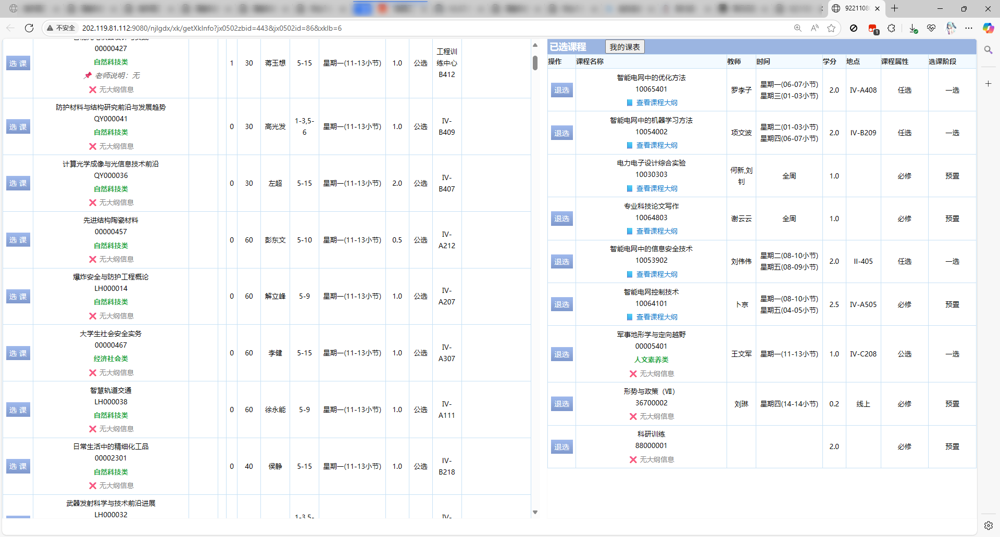
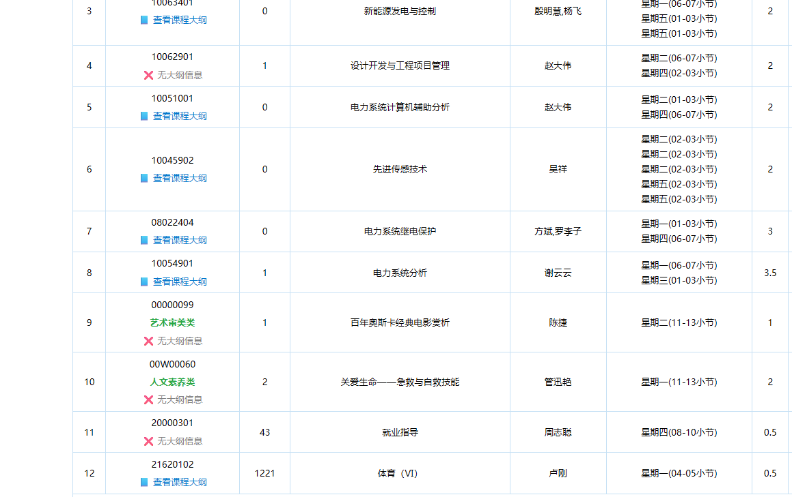
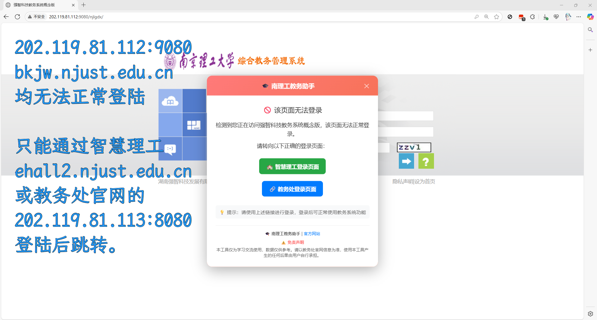

# 🧩 增强功能详细说明

## 功能展示

### 1. 教学大纲与选修课分类显示

在课表、选课和成绩页面，自动为每门课程添加教学大纲链接，点击即可跳转查看详情。

- 大部分课程可直接访问教学大纲页面  
- 若未上传大纲，显示为“无信息”




---

### 2. 成绩页学分统计与课程分类展示

在“成绩”页面中，自动识别课程所属类别（如公选课、人文素养等），并按类统计已修学分。


---

### 3. 登录页面优化提示

误入无效教务系统入口时，会弹出提示信息，引导用户跳转至正确登录地址。

> 南理工教务系统入口说明：
> 
> ✅ 正确入口：[http://202.119.81.113:8080/](http://202.119.81.113:8080/)  
> ✅ 智慧理工平台：[https://ehall2.njust.edu.cn/](https://ehall2.njust.edu.cn/)（初次跳转可能报 SSL 错）  
> ❌ 错误入口：[http://202.119.81.112:9080/](http://202.119.81.112:9080/)  
> ❌ 错误入口：[https://bkjw.njust.edu.cn/](https://bkjw.njust.edu.cn/)



---

## 工作原理

脚本通过远程加载两份核心数据文件实现功能增强：

### 1. 选修课分类数据（`xxk.json`）

```json
[
  {
    "course_code": "00000011",
    "course_name": "坦克学",
    "category": "自然科技类"
  }
]
```

---

### 2. 教学大纲链接数据（`kcdg.json`）

```json
[
  {
    "id": "572BF3AE025044A7BDD7AF953460102C",
    "course_code": "161803E1"
  }
]
```

---

### 3.更新数据文件

如果你认为已有的 `kcdg.json`版本已过时（例如您在 2026 年 7 月 4 日使用这个脚本），请参考考
[课程大纲采集流程（README.getKCDG.md）](./README.getKCDG.md)
重新采集课程大纲。


如果你认为已有的 `xxk.json`版本已过时（例如您在 2026 年 7 月 4 日使用这个脚本），请参考
[选修课采集流程（README.getXXK.md）](./README.getKCDG.md)
重新采集选修课分类数据。