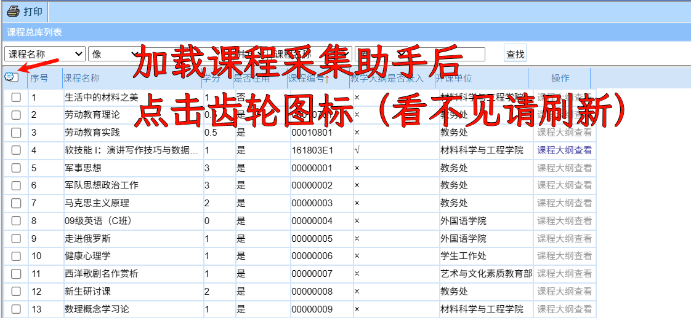
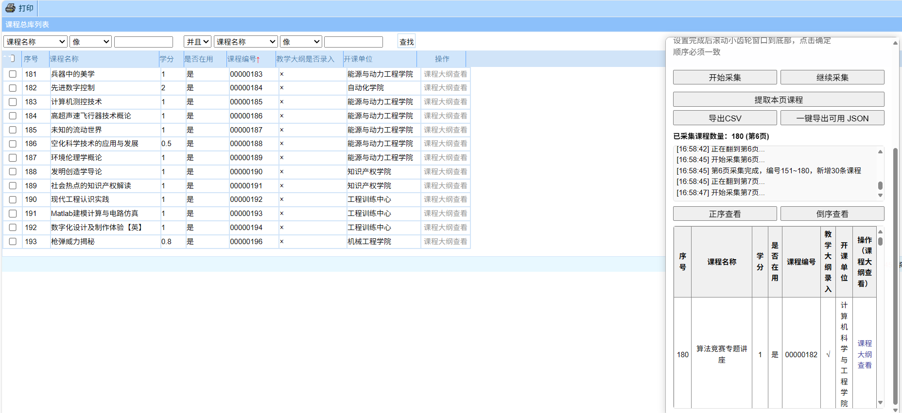

# 📦 南理工教务处课程采集助手 V2

> 本文档介绍如何使用 `getKCDG.js` 脚本采集课程大纲映射数据
> 
> ⚠️ **提示：普通用户无需采集数据，增强脚本已内置 2022 版大纲的最新版本**
>

---

## 📥 数据采集过程

由于课程总库架构较旧，部分功能需要兼容性调整。`getKCDG.js` 已对其做兼容处理，可在现代浏览器中稳定运行。

### 采集步骤

1. 先从登陆教务系统，再访问[课程总库](http://202.119.81.112:9080/njlgdx/pyfa/kcdgxz)页面
2. 配置字段显示，如下图所示：




3. 点击“确定”保存设置  
4. 若提示地址跳转，点击确认进入真实采集页面：


5. 点击“开始采集”，脚本会自动提取课程数据并进行结构化处理：



6. 数据采集完成后，可导出为 CSV 格式：


7.通过[CSV 课程数据筛选工具](https://enhance.njust.wiki/tools/csv2json.html)将 csv 中的有用数据导出为 JSON 格式：


---

### 更新数据文件

如果你发现已有的 `kcdg.json` 版本已过时，可以进行如下操作

1. 使用脚本采集课程数据
2. 导出为 `.csv`
3. 通过[CSV 课程数据筛选工具](https://enhance.njust.wiki/tools/csv2json.html)筛选出已上传大纲的课程
4. 导出结构化的 JSON 格式 ```kcdg.json``` 如下：

```json
[
  {
    "id": "572BF3AE025044A7BDD7AF953460102C",
    "course_code": "161803E1"
  },
  ......
]
```

- 将新生成的 json 上传至服务器

    然后将用户脚本中的分类数据地址替换为新的链接，例如：

    ```js
        const OUTLINE_URL = 'https://fastly.jsdelivr.net/gh/NJUST-OpenLib/NJUST-JWC-Enhance@latest/data/kcdg.json'
    ```

- 或，提交 Pull Request 更新本项目的 `data/kcdg.json`
