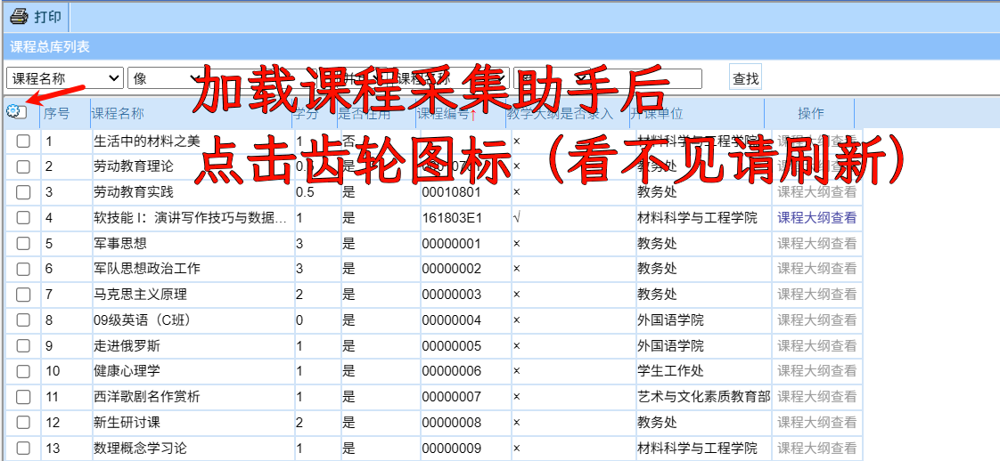
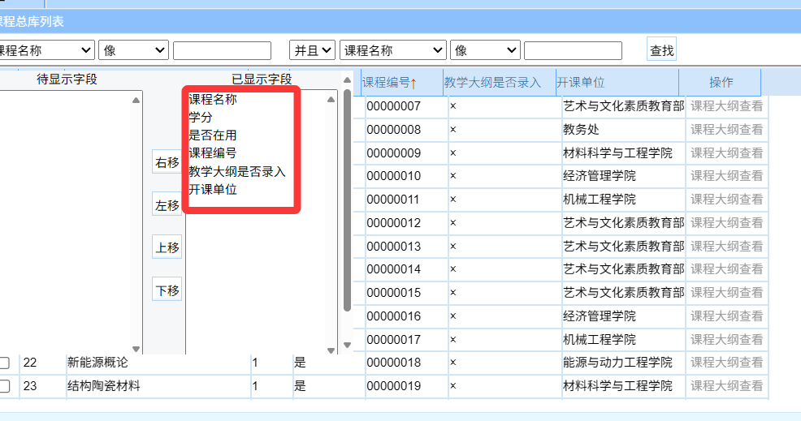
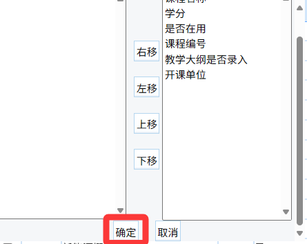
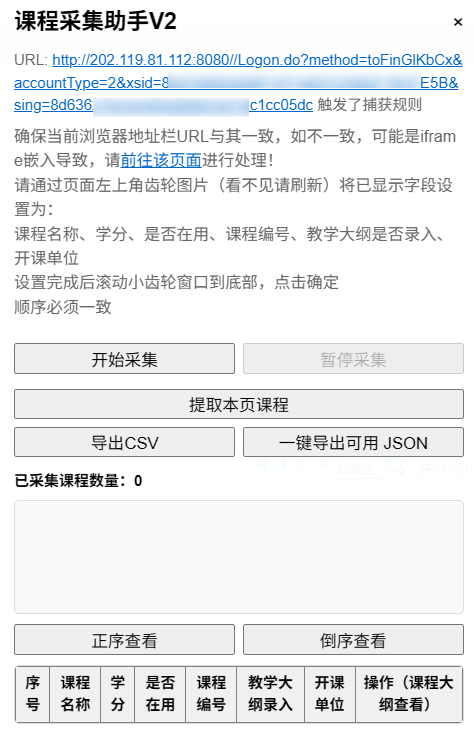
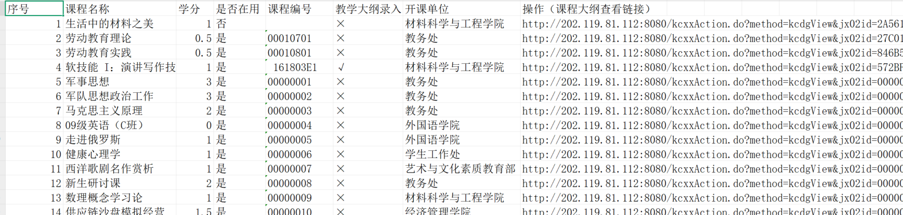

你的文档整体结构清晰、逻辑流畅，已经写得非常不错了。以下是我润色后的版本，主要对措辞、标点、语义清晰度和专业性做了提升，并修复了一个小的编号错误（原文中的“第 4 点”实际上是“第 3 点”）：

---

# NJUST-JWC-Enhance

南京理工大学教务系统增强脚本

## 功能特性

本脚本实现以下功能增强：

* 在课表、选课、成绩页面中显示课程教学大纲
* 显示选修课的类别信息
* 在成绩页面自动汇总选修课程的已修学分
* 对错误的登录页面进行提示，引导用户前往正确地址

## 功能展示

### 1. 教学大纲与选修课分类显示

在课表、选课和成绩页面的课程信息中添加教学大纲链接，便于用户快速查看课程详情。


### 2. 学分统计与选修课分类展示

在成绩页面中，按课程分类及通识选修类别，分别汇总已修课程及其学分。


### 3. 登录页面提示优化

当用户误进入无法登录的教务系统地址时，自动弹出提示，引导用户跳转到正确的登录入口。

> 南理工教务系统包含多个入口，详情如下：
> 
> * ✅ 正确入口：[http://202.119.81.113:8080/](http://202.119.81.113:8080/)（教务处官网）
> *  ✅ 正确入口：[https://ehall2.njust.edu.cn/](https://ehall2.njust.edu.cn/)（智慧理工搜索教务。注，第一次跳转会出现SSL错误，原因是天才信息化处把https请求发到80端口了。回到智慧理工再搜一次就行了）
> *  信息化处说是教务处的问题，智慧理工这个问题不归他们管。教务处说信息化处的系统有问题，是他们的问题。
> * ❌ 错误入口：[http://202.119.81.112:9080/](http://202.119.81.112:9080/)（只能通过教务处跳转进入，首页的登录框本身不可用）
> * ❌ 错误入口：[https://bkjw.njust.edu.cn/](https://bkjw.njust.edu.cn/)（只能通过“智慧理工”平台搜索“教务”跳转进入，首页的登录框本身不可用）


> 注意：验证码区分大小写，绝大多数字母为小写。


## 工作原理

本脚本通过远程读取两个核心 JSON 数据文件，实现数据增强：

### 1. 选修课类别数据（`xxk.json`）

包含课程号与课程名、所属选修类别的对应关系。

```json
[
  {
    "course_code": "课程号",
    "course_name": "课程名",
    "category": "分类"
  },
  {
    "course_code": "00000011",
    "course_name": "坦克学",
    "category": "自然科技类"
  }
]
```

* **数据来源：** 教务处官网
* **更新频率：** 每四年更新一次（当前为 2022 版方案，前一版为 2018）

### 2. 教学大纲数据（`kcdg.json`）

记录课程的系统 ID 与课程编号之间的映射关系。

```json
[
  {
    "id": "572BF3AE025044A7BDD7AF953460102C",
    "course_code": "161803E1"
  },
  {
    "id": "00000023",
    "course_code": "00000023"
  }
]
```

* **数据来源：** 从[课程总库](http://202.119.81.112:9080/njlgdx/pyfa/kcdgxz)爬取并筛选而来
* **数据规模：** 总库约有 380 页、一万余条课程记录，但是仅约一千条课程上传了教学大纲
* **更新频率：** 预计每年更新一次

## 技术实现

### 数据获取

由于课程总库网页架构陈旧，部分功能需 IE6 浏览器支持，因此在 `getKCDG.js` 脚本中重写了一下功能，以保证页面自带的选框可供配置，数据可正常读取：

* 课程名称
* 学分信息
* 使用状态
* 课程编号
* 教学大纲录入状态
* 开课单位
  



调整```已显示的字段```如图所示



点击确定保存


脚本提示当前采集页面可能和访问页面不一致，点击进入实际地址



点击开始采集，会自动提取所有课程并保存为结构化数据


采集完毕后导出即可。其中 CSV 为完整内容，JSON 为筛选后的内容。



本程序使用的是筛选后的 JSON，如需其他用途可导出完整 CSV


### 数据处理流程

1. 使用 `getKCDG.js` 脚本逐页爬取课程总库数据
2. 导出为 CSV 文件
3. 通过 `conv.py` 脚本将 CSV 转换为所需 JSON 格式
4. 自动剔除未上传教学大纲的课程记录

## 使用方法

1. 安装浏览器扩展 [Tampermonkey](https://www.tampermonkey.net/)
2. 导入本脚本
3. 登录南京理工大学教务系统，即可自动启用增强功能

## 免责声明 ⚠️

* 本脚本仅修改前端展示效果，不会对教务系统服务器端数据造成影响

* 本脚本在您浏览器上运行，不会传递出任何信息。
  
* 南理工教务系统具有大量前端验证机制，脚本没有刻意去做，但不保证用户修改前端是否会导致意料之外的后果。例如，您可以把课程附近的“display=none”删去，以显示退课按钮，进而实现大学四年所修学分为 0 分。

* 尽管从原理上不会造成任何破坏，但强智系统十份复杂和冗余，使用本工具仍存在未知风险，使用者需自行承担后果
  
* **开发者不对任何因使用本工具而产生的后果承担责任**

## 技术栈

* JavaScript（前端增强脚本）
* Python（数据爬取与处理）
* Tampermonkey（用户脚本管理器）

---

> *注：部分变量命名遵循原教务系统命名规范，以保证兼容性*

---

如你有后续打算发布到 GitHub 或其他平台，也可以加上一段“贡献指南”“许可协议”部分。如果你有具体用途，我可以继续帮你扩展。
