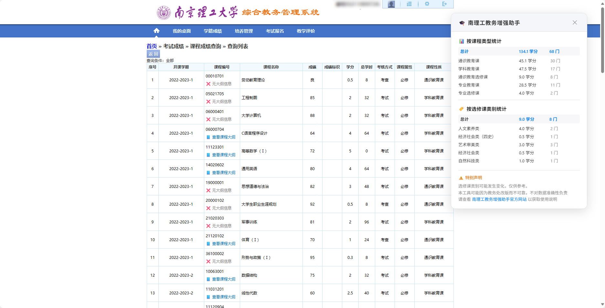

# 🎓 南理工教务系统增强助手

> 🧩 让教务系统更顺手的浏览器脚本  
> 💡 支持南京理工大学和其他使用“湖南强智教务系统”的高校

<div align="center">
  
<br>
  

<p>
  
  
  
  
  
</p>
## Star History

<a href="https://www.star-history.com/#NJUST-OpenLib/NJUST-JWC-Enhance&Date">
 <picture>
   <source media="(prefers-color-scheme: dark)" srcset="https://api.star-history.com/svg?repos=NJUST-OpenLib/NJUST-JWC-Enhance&type=Date&theme=dark" />
   <source media="(prefers-color-scheme: light)" srcset="https://api.star-history.com/svg?repos=NJUST-OpenLib/NJUST-JWC-Enhance&type=Date" />
   
 </picture>
</a>

</div>

## 关注我们

- [📖 南理工生存手册](https://manual.njust.wiki)
- [💻 GitHub 仓库](https://github.com/NJUST-OpenLib/NJUST-JWC-Enhance)
- [🐱 ScriptCat 脚本猫](https://scriptcat.org/zh-CN/users/174962)
- [🔧 GreasyFork](https://greasyfork.org/zh-CN/users/1491624-njust-openlib)

---

## ✨ 功能概览

- 🔗 教学大纲快捷访问
- 🏷️ 选修类别自动显示
- 📊 成绩页学分统计
- 🚪 登录页面智能提示
- 📥 配套的数据采集及处理工具

---

## 📖 更多功能详解

详细图文说明和数据结构介绍请参见：

- 🧩 [增强助手功能说明](./README.enhance.md)

- 📦 [课程大纲采集流程（使用课程采集助手 V2）](./README.getKCDG.md)

- 📦 [选修课采集流程（README.getXXK.md）](./README.getXXK.md)

- 🧰 [数据格式处理工具集](https://enhance.njust.wiki/tools)
  
---

## 🚀 快速开始

### 0 预备知识

- Tampermonkey 和 ScriptCat 都是脚本管理器，安装一个即可

- scriptcat.org 和 GreasyFork.org 都是脚本仓库，选择一个即可

---

### 1 安装脚本管理器

推荐以下浏览器插件（任选一个）：

- **Tampermonkey（主流推荐）**
  - [Chrome 商店](https://chrome.google.com/webstore/detail/tampermonkey/dhdgffkkebhmkfjojejmpbldmpobfkfo)
  - [Edge 商店（推荐）](https://microsoftedge.microsoft.com/addons/detail/tampermonkey/iikmkjmpaadaobahmlepeloendndfphd)
  - [Firefox 商店](https://addons.mozilla.org/zh-CN/firefox/addon/tampermonkey/)
  
- **ScriptCat 脚本猫（国产开源）**
  - [官方主页](https://docs.scriptcat.org/)

#### 1.2 安装脚本管理器

对于在基于 Chrome 的浏览器中使用扩展（版本 5.3+）的用户，必须启用“允许用户脚本”切换开关（在 Chrome 138+ 中可通过扩展设置找到）或 开发者模式

[Tampermonkey 开启开发者模式](https://www.tampermonkey.net/faq.php?version=5.4.6227&ext=gcal#Q209)

[Scriptcat 开启开发者模式](https://docs.scriptcat.org/docs/use/open-dev/)

---

### 2 安装 ```南理工教务增强助手```

已经自带选修课数据和课程大纲数据。  
两个网站找一个适合的安装脚本即可  

- [📦 ScriptCat.org](https://scriptcat.org/zh-CN/script-show-page/3745/)
- [📦 GreasyFork](https://greasyfork.org/zh-CN/scripts/541627)

### 可选功能：安装```数据采集助手 V2```  

用于获取课程大纲数据，仅供开发者使用  

[ScriptCat.org](https://scriptcat.org/zh-CN/script-show-page/3744/)
[GreasyFork](https://greasyfork.org/zh-CN/scripts/541628)

---

### 3 启用脚本


访问 [教务系统主页](http://202.119.81.113:8080/)，脚本会自动启用，无需手动配置。

### 4 刷新登录状态

如果您在点击课程大纲时遇到以下提示：


证明课程总库登陆状态无效，为应对该问题，系统将在

- 首次登陆成功后每五分钟
- 每次出现提示时

自动尝试加载```http://202.119.81.112:9080/njlgdx/pyfa/kcdgxz```隐藏页面来刷新课程总库的登录状态。（大概率不成功，建议使用下方手动方法）  
但如果您仍然无法访问，请直接访问以下任一地址手动刷新：

- <http://202.119.81.112:9080/njlgdx/pyfa/kcdgxz（教务处）>
- <http://bkjw.njust.edu.cn/njlgdx/pyfa/kcdgxz（智慧理工）>

完成后您应当可以点击课程大纲。

---

## ⚠️ 注意事项

**本脚本完全开源，不对可靠性做任何保证。**

**因使用本脚本产生的任何后果，开发者概不负责，请自行判断风险**

- 本脚本不会修改服务器数据，关闭插件即恢复原状
- 所有功能均在本地执行，无任何统计功能，不会上传或收集任何信息
- 强智系统结构复杂，因此部分功能可能随系统更新而失效
- 附带的数据文件具有一定时效性，且开发者毕业后可能无法持续更新
- 教务系统大量依赖前端校验，更改前端页面有风险
- 选课统计因网络波动等原因不一定准确，请以教务处官网为准
  
---

## 🤝 参与贡献

欢迎提交 Issue、PR 或数据更新：

- `xxk.json`（选修课分类）：建议每 4 年更新一次。  
  参考[选修课采集流程（README.getXXK.md）](./README.getXXK.md)

- `kcdg.json`（教学大纲映射）：建议每年更新一次  
 参考 [课程大纲采集流程（README.getKCDG.md）](./README.getKCDG.md)

---

## 📄 License

本项目采用 [MIT License](./LICENSE) 开源。

---

## 📬 联系我们

- 邮箱：<admin@njust.wiki>  
- 提交问题：[GitHub Issues](https://github.com/NJUST-OpenLib/NJUST-JWC-Enhance/issues)
  
部分变量命名源于教务系统字段，例如：

| 变量名 | 含义 |
|--------|------|
| kcdg | 课程大纲 |
| xxk | 选修课 |
| kczk | 课程总库 |

~~绝对不是英语水平差！~~

<div align="center" style="font-size: 0.9em; color: #666;">
  <p>项目由 <a href="https://github.com/NJUST-OpenLib" target="_blank">NJUST OpenLib</a> 社区维护</p>

  <p>made with ❤️ by <a href="https://miko.pw" target="_blank">Light</a><br/>
    版权所有 © 2024–2025 <a href="https://njust.wiki" target="_blank">NJUST.WIKI</a><br/>
  </p>
</div>
